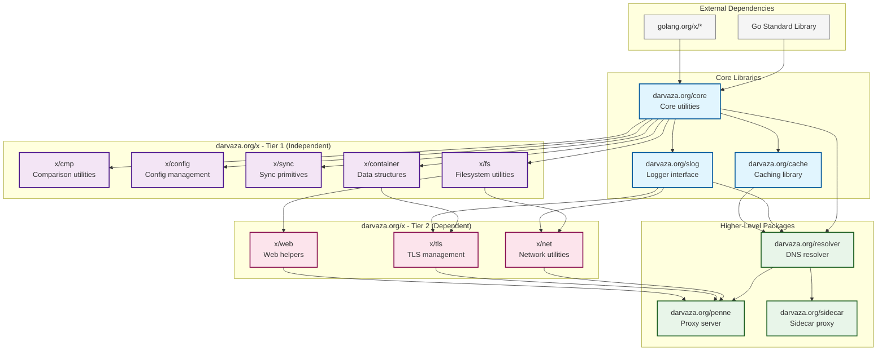

# Darvaza Extra

[![Go Reference][godoc-badge]][godoc]
[![Go Report Card][goreport-badge]][goreport]
[![codecov][codecov-badge]][codecov]

`darvaza.org/x` hosts mid-complexity packages with no significant dependencies
or assumptions.

[godoc]: https://pkg.go.dev/darvaza.org/x
[godoc-badge]: https://pkg.go.dev/badge/darvaza.org/x.svg
[goreport]: https://goreportcard.com/report/darvaza.org/x
[goreport-badge]: https://goreportcard.com/badge/darvaza.org/x
[codecov]: https://codecov.io/gh/darvaza-proxy/x
[codecov-badge]: https://codecov.io/github/darvaza-proxy/x/graph/badge.svg

## Dependencies

The _Darvaza Extra_ modules are built on top of a handful of low(ish) level
packages in addition to the Go Standard Library.

* Our _core_ package, [darvaza.org/core][core], which handles network
  addresses, worker groups, errors and lists among other simple helpers.
* Our _structured logger_ interface, [darvaza.org/slog][slog], allowing
  users to hook their favourite logger.
* Our thin and simple _LRU_ for local in-memory caching,
  [darvaza.org/cache/x/simplelru][simplelru].

## Packages

### CMP

[darvaza.org/x/cmp][x-cmp] provides generic comparison and matching
utilities leveraging Go generics.

### Config

[darvaza.org/x/config][x-config] provides helpers for dealing with config
files.

### Container

[darvaza.org/x/container][x-container] provides data structures including
lists, sets, and slice utilities.

### FS

[darvaza.org/x/fs][x-fs] provides file system utilities including file
locking, globbing, and I/O helpers.

### Net

[darvaza.org/x/net][x-net] provides network utilities including dialer,
bind helpers, and reconnect client.

### Sync

[darvaza.org/x/sync][x-sync] provides advanced synchronization primitives
including mutexes, semaphores, barriers, and workgroups.

### TLS

[darvaza.org/x/tls][x-tls] provides helpers to work with TLS connections
and certificates.

### Web

[darvaza.org/x/web][x-web] provides helpers for implementing HTTP handlers.

## Development

For development guidelines, architecture notes, and AI agent instructions, see
[AGENT.md](AGENT.md).

## Architecture Overview

The following C4 Context diagram shows the relationships between all
darvaza.org packages:

### Package Relationships

* **Core Libraries**: Foundational packages that provide basic functionality
  * `darvaza.org/core`: Network addresses, error handling, worker groups
  * `darvaza.org/slog`: Structured logging interface
  * `darvaza.org/cache`: LRU caching with `simplelru`

* **Tier 1 Packages**: No internal dependencies within `x/`
  * Can be released independently
  * Depend only on core libraries and standard library

* **Tier 2 Packages**: Depend on Tier 1 packages
  * `net` and `web` depend on `fs`
  * `tls` depends on `container`
  * Must be released after their dependencies

* **Higher-Level Packages**: Built on top of `x/` packages
  * `resolver`: DNS resolution capabilities
  * `penne` and `sidecar`: Proxy implementations

## See also

* [JPI Technologies' Open-Source Software](https://oss.jpi.io/).
* _darvaza libraries_:
  * [darvaza.org/cache][cache].
  * [darvaza.org/core][core].
  * [darvaza.org/resolver][resolver].
  * [darvaza.org/slog][slog].
  * [darvaza.org/x/cmp][x-cmp].
  * [darvaza.org/x/config][x-config].
  * [darvaza.org/x/container][x-container].
  * [darvaza.org/x/fs][x-fs].
  * [darvaza.org/x/net][x-net].
  * [darvaza.org/x/sync][x-sync].
  * [darvaza.org/x/tls][x-tls].
  * [darvaza.org/x/web][x-web].
* _darvaza servers_:
  * [darvaza.org/penne][penne].
  * [darvaza.org/sidecar][sidecar].

[cache]: https://pkg.go.dev/darvaza.org/cache
[core]: https://pkg.go.dev/darvaza.org/core
[penne]: https://pkg.go.dev/darvaza.org/penne
[resolver]: https://pkg.go.dev/darvaza.org/resolver
[sidecar]: https://pkg.go.dev/darvaza.org/sidecar
[simplelru]: https://pkg.go.dev/darvaza.org/cache/x/simplelru
[slog]: https://pkg.go.dev/darvaza.org/slog
[x-cmp]: https://pkg.go.dev/darvaza.org/x/cmp
[x-config]: https://pkg.go.dev/darvaza.org/x/config
[x-container]: https://pkg.go.dev/darvaza.org/x/container
[x-fs]: https://pkg.go.dev/darvaza.org/x/fs
[x-net]: https://pkg.go.dev/darvaza.org/x/net
[x-sync]: https://pkg.go.dev/darvaza.org/x/sync
[x-tls]: https://pkg.go.dev/darvaza.org/x/tls
[x-web]: https://pkg.go.dev/darvaza.org/x/web
