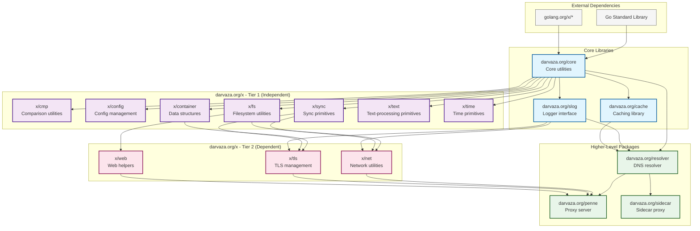

# Darvaza Extra

[![codecov][codecov-badge]][codecov-link]

`darvaza.org/x` hosts mid-complexity packages with no significant dependencies
or assumptions.

## Dependencies

The _Darvaza Extra_ modules are built on top of a handful of low(ish) level
packages in addition to the Go Standard Library.

* Our _core_ package, [darvaza.org/core][core], which handles network
  addresses, worker groups, errors and lists among other simple helpers.
* Our _structured logger_ interface, [darvaza.org/slog][slog], allowing
  users to hook their favourite logger.
* Our thin and simple _LRU_ for local in-memory caching,
  [darvaza.org/cache/x/simplelru][simplelru].

## Packages

Each package is a separate Go module, tagged and released independently.

### CMP

[![Go Reference][cmp-godoc-badge]][x-cmp]
[![codecov][cmp-codecov-badge]][codecov-link]
[![Socket Badge][cmp-socket-badge]][cmp-socket-link]

[darvaza.org/x/cmp][x-cmp] provides generic comparison and matching
utilities leveraging Go generics.
Its `Matcher` interface combines predicates with `And`, `Or` and `Not`,
and `Compose` matches a value extracted from another type.

### Config

[![Go Reference][config-godoc-badge]][x-config]
[![codecov][config-codecov-badge]][codecov-link]
[![Socket Badge][config-socket-badge]][config-socket-link]

[darvaza.org/x/config][x-config] provides helpers for dealing with
configuration files.
It loads a configuration from a list of candidate files, expands
shell-style variables, applies default values and validates the result.
Its `appdir` subpackage locates an application's cache, configuration
and data directories, following XDG and the FHS, with native
equivalents on Windows.

### Container

[![Go Reference][container-godoc-badge]][x-container]
[![codecov][container-codecov-badge]][codecov-link]
[![Socket Badge][container-socket-badge]][container-socket-link]

[darvaza.org/x/container][x-container] provides data structures including
lists, sets, and slice utilities.
`list` wraps the standard `container/list` with generics, `set` is a
thread-safe map-based set with configurable keys and hashing, and
`slices` holds sorted slice-based sets.

### FS

[![Go Reference][fs-godoc-badge]][x-fs]
[![codecov][fs-codecov-badge]][codecov-link]
[![Socket Badge][fs-socket-badge]][fs-socket-link]

[darvaza.org/x/fs][x-fs] provides file system utilities including file
locking, globbing, and I/O helpers.
It extends `io/fs` with interfaces for the `os` package's operations,
such as `MkdirFS` and `RenameFS`, and its globs take `**` to match
across directories. As it shadows `io/fs`, it proxies that package's
common types, constants and functions too.

### Net

[![Go Reference][net-godoc-badge]][x-net]
[![codecov][net-codecov-badge]][codecov-link]
[![Socket Badge][net-socket-badge]][net-socket-link]

[darvaza.org/x/net][x-net] provides network utilities including dialer,
bind helpers, and reconnect client.
`bind` listens on several interfaces and addresses at once, retrying
ports and setting socket options such as `SO_REUSEPORT`, and `reconnect`
is a TCP and Unix socket client that redials after a configurable wait,
with callbacks around each connection's lifecycle.

### Sync

[![Go Reference][sync-godoc-badge]][x-sync]
[![codecov][sync-codecov-badge]][codecov-link]
[![Socket Badge][sync-socket-badge]][sync-socket-link]

[darvaza.org/x/sync][x-sync] provides advanced synchronisation primitives
including mutexes, semaphores, barriers, and workgroups.
It defines standard `Mutex` and `RWMutex` interfaces, with context-aware
variants and helpers that lock several mutexes at once, and `cond` holds
coordination primitives such as `Barrier`, `Count` and `Turnstile`.

### Text

[![Go Reference][text-godoc-badge]][x-text]
[![codecov][text-codecov-badge]][codecov-link]
[![Socket Badge][text-socket-badge]][text-socket-link]

[darvaza.org/x/text][x-text] provides shared text-processing primitives,
including a state-function lexer toolkit and a version sort for
strings.
`buffer` wraps `strings.Builder` for text written in many pieces and
exported once, and `versionsort` compares runs of digits by the number
they write, so `ttyS10` follows `ttyS9`.

### Time

[![Go Reference][time-godoc-badge]][x-time]
[![codecov][time-codecov-badge]][codecov-link]
[![Socket Badge][time-socket-badge]][time-socket-link]

[darvaza.org/x/time][x-time] provides time-related primitives that
complement the standard library.
Its `num` subpackage holds fixed-width numeric types for them: 32-, 64-
and 128-bit integers, and fixed-point decimals at milli and atto
resolution. Their arithmetic wraps on overflow, as Go's integers do.

### TLS

[![Go Reference][tls-godoc-badge]][x-tls]
[![codecov][tls-codecov-badge]][codecov-link]
[![Socket Badge][tls-socket-badge]][tls-socket-link]

[darvaza.org/x/tls][x-tls] provides helpers to work with TLS connections
and certificates.
Its `Store` interfaces describe a source of certificates and trust that
changes while in use, and plug into a `tls.Config`. It also builds
certificate chains, routes connections by their Server Name Indication,
and offers X.509 and PEM utilities.

### Web

[![Go Reference][web-godoc-badge]][x-web]
[![codecov][web-codecov-badge]][codecov-link]
[![Socket Badge][web-socket-badge]][web-socket-link]

[darvaza.org/x/web][x-web] provides helpers for implementing HTTP handlers.
It covers middleware, path cleaning, content negotiation through quality
lists, and HTTP errors that are handlers themselves, while `resource`
wraps a type to serve a RESTful interface to it.

## Development

For development guidelines, architecture notes, and AI agent instructions, see
[AGENTS.md](AGENTS.md).

## Architecture Overview

The following C4 Context diagram shows the relationships between all
darvaza.org packages:

```mermaid
graph TB
    subgraph "External Dependencies"
        stdlib[Go Standard Library]
        ext[golang.org/x/*]
    end

    subgraph "Core Libraries"
        core[darvaza.org/core<br/>Core utilities]
        slog[darvaza.org/slog<br/>Logger interface]
        cache[darvaza.org/cache<br/>Caching library]
    end

    subgraph "darvaza.org/x - Tier 1 (Independent)"
        cmp[x/cmp<br/>Comparison utilities]
        config[x/config<br/>Config management]
        sync[x/sync<br/>Sync primitives]
        fs[x/fs<br/>Filesystem utilities]
        container[x/container<br/>Data structures]
        text[x/text<br/>Text-processing primitives]
        time[x/time<br/>Time primitives]
    end

    subgraph "darvaza.org/x - Tier 2 (Dependent)"
        net[x/net<br/>Network utilities]
        web[x/web<br/>Web helpers]
        tls[x/tls<br/>TLS management]
    end

    subgraph "Higher-Level Packages"
        resolver[darvaza.org/resolver<br/>DNS resolver]
        penne[darvaza.org/penne<br/>Proxy server]
        sidecar[darvaza.org/sidecar<br/>Sidecar proxy]
    end

    %% Core dependencies
    stdlib --> core
    ext --> core
    core --> slog
    core --> cache

    %% x/ Tier 1 dependencies
    core --> cmp
    core --> config
    core --> sync
    core --> fs
    core --> container
    core --> text
    core --> time

    %% x/ Tier 2 dependencies
    fs --> net
    fs --> web
    sync --> net
    container --> tls
    sync --> tls
    slog --> net
    slog --> tls

    %% Higher-level dependencies
    core --> resolver
    slog --> resolver
    cache --> resolver

    resolver --> penne
    resolver --> sidecar
    net --> penne
    tls --> penne
    web --> penne

    classDef core fill:#e1f5fe,stroke:#01579b,stroke-width:2px
    classDef tier1 fill:#f3e5f5,stroke:#4a148c,stroke-width:2px
    classDef tier2 fill:#fce4ec,stroke:#880e4f,stroke-width:2px
    classDef external fill:#f5f5f5,stroke:#616161,stroke-width:1px
    classDef highlevel fill:#e8f5e9,stroke:#1b5e20,stroke-width:2px

    class core,slog,cache core
    class cmp,config,sync,fs,container,text,time tier1
    class net,web,tls tier2
    class stdlib,ext external
    class resolver,penne,sidecar highlevel
```

### Package Relationships

* **Core Libraries**: Foundational packages that provide basic functionality
  * `darvaza.org/core`: Network addresses, error handling, worker groups
  * `darvaza.org/slog`: Structured logging interface
  * `darvaza.org/cache`: LRU caching with `simplelru`

* **Tier 1 Packages**: No internal dependencies within `x/`
  * Can be released independently
  * Depend only on core libraries and standard library

* **Tier 2 Packages**: Depend on Tier 1 packages
  * `net` depends on `fs` and `sync`
  * `web` depends on `fs`
  * `tls` depends on `container` and `sync`
  * Must be released after their dependencies

* **Higher-Level Packages**: Built on top of `x/` packages
  * `resolver`: DNS resolution capabilities
  * `penne` and `sidecar`: Proxy implementations

## See also

* [Apptly Software Open-Source Projects](https://oss.apptly.co/).
* _darvaza libraries_:
  * [darvaza.org/cache][cache]
  * [darvaza.org/core][core]
  * [darvaza.org/resolver][resolver]
  * [darvaza.org/slog][slog]
  * [darvaza.org/x/cmp][x-cmp]
  * [darvaza.org/x/config][x-config]
  * [darvaza.org/x/container][x-container]
  * [darvaza.org/x/fs][x-fs]
  * [darvaza.org/x/net][x-net]
  * [darvaza.org/x/sync][x-sync]
  * [darvaza.org/x/text][x-text]
  * [darvaza.org/x/time][x-time]
  * [darvaza.org/x/tls][x-tls]
  * [darvaza.org/x/web][x-web]
* _darvaza servers_:
  * [darvaza.org/penne][penne]
  * [darvaza.org/sidecar][sidecar]

[cache]: https://pkg.go.dev/darvaza.org/cache
[core]: https://pkg.go.dev/darvaza.org/core
[penne]: https://pkg.go.dev/darvaza.org/penne
[resolver]: https://pkg.go.dev/darvaza.org/resolver
[sidecar]: https://pkg.go.dev/darvaza.org/sidecar
[simplelru]: https://pkg.go.dev/darvaza.org/cache/x/simplelru
[slog]: https://pkg.go.dev/darvaza.org/slog
[x-cmp]: https://pkg.go.dev/darvaza.org/x/cmp
[x-config]: https://pkg.go.dev/darvaza.org/x/config
[x-container]: https://pkg.go.dev/darvaza.org/x/container
[x-fs]: https://pkg.go.dev/darvaza.org/x/fs
[x-net]: https://pkg.go.dev/darvaza.org/x/net
[x-sync]: https://pkg.go.dev/darvaza.org/x/sync
[x-text]: https://pkg.go.dev/darvaza.org/x/text
[x-time]: https://pkg.go.dev/darvaza.org/x/time
[x-tls]: https://pkg.go.dev/darvaza.org/x/tls
[x-web]: https://pkg.go.dev/darvaza.org/x/web

[codecov-link]: https://codecov.io/gh/darvaza-proxy/x
[codecov-badge]: https://codecov.io/github/darvaza-proxy/x/graph/badge.svg

[cmp-godoc-badge]: https://awesome-apptly.com/api/badge/go/darvaza.org/x/cmp
[cmp-codecov-badge]: https://codecov.io/github/darvaza-proxy/x/graph/badge.svg?flag=cmp
[cmp-socket-badge]: https://badge.socket.dev/go/package/darvaza.org/x/cmp
[cmp-socket-link]: https://socket.dev/go/package/darvaza.org/x/cmp

[config-godoc-badge]: https://awesome-apptly.com/api/badge/go/darvaza.org/x/config
[config-codecov-badge]: https://codecov.io/github/darvaza-proxy/x/graph/badge.svg?flag=config
[config-socket-badge]: https://badge.socket.dev/go/package/darvaza.org/x/config
[config-socket-link]: https://socket.dev/go/package/darvaza.org/x/config

[container-godoc-badge]: https://awesome-apptly.com/api/badge/go/darvaza.org/x/container
[container-codecov-badge]: https://codecov.io/github/darvaza-proxy/x/graph/badge.svg?flag=container
[container-socket-badge]: https://badge.socket.dev/go/package/darvaza.org/x/container
[container-socket-link]: https://socket.dev/go/package/darvaza.org/x/container

[fs-godoc-badge]: https://awesome-apptly.com/api/badge/go/darvaza.org/x/fs
[fs-codecov-badge]: https://codecov.io/github/darvaza-proxy/x/graph/badge.svg?flag=fs
[fs-socket-badge]: https://badge.socket.dev/go/package/darvaza.org/x/fs
[fs-socket-link]: https://socket.dev/go/package/darvaza.org/x/fs

[net-godoc-badge]: https://awesome-apptly.com/api/badge/go/darvaza.org/x/net
[net-codecov-badge]: https://codecov.io/github/darvaza-proxy/x/graph/badge.svg?flag=net
[net-socket-badge]: https://badge.socket.dev/go/package/darvaza.org/x/net
[net-socket-link]: https://socket.dev/go/package/darvaza.org/x/net

[sync-godoc-badge]: https://awesome-apptly.com/api/badge/go/darvaza.org/x/sync
[sync-codecov-badge]: https://codecov.io/github/darvaza-proxy/x/graph/badge.svg?flag=sync
[sync-socket-badge]: https://badge.socket.dev/go/package/darvaza.org/x/sync
[sync-socket-link]: https://socket.dev/go/package/darvaza.org/x/sync

[text-godoc-badge]: https://awesome-apptly.com/api/badge/go/darvaza.org/x/text
[text-codecov-badge]: https://codecov.io/github/darvaza-proxy/x/graph/badge.svg?flag=text
[text-socket-badge]: https://badge.socket.dev/go/package/darvaza.org/x/text
[text-socket-link]: https://socket.dev/go/package/darvaza.org/x/text

[time-godoc-badge]: https://awesome-apptly.com/api/badge/go/darvaza.org/x/time
[time-codecov-badge]: https://codecov.io/github/darvaza-proxy/x/graph/badge.svg?flag=time
[time-socket-badge]: https://badge.socket.dev/go/package/darvaza.org/x/time
[time-socket-link]: https://socket.dev/go/package/darvaza.org/x/time

[tls-godoc-badge]: https://awesome-apptly.com/api/badge/go/darvaza.org/x/tls
[tls-codecov-badge]: https://codecov.io/github/darvaza-proxy/x/graph/badge.svg?flag=tls
[tls-socket-badge]: https://badge.socket.dev/go/package/darvaza.org/x/tls
[tls-socket-link]: https://socket.dev/go/package/darvaza.org/x/tls

[web-godoc-badge]: https://awesome-apptly.com/api/badge/go/darvaza.org/x/web
[web-codecov-badge]: https://codecov.io/github/darvaza-proxy/x/graph/badge.svg?flag=web
[web-socket-badge]: https://badge.socket.dev/go/package/darvaza.org/x/web
[web-socket-link]: https://socket.dev/go/package/darvaza.org/x/web
